# 计算机网络原理

## 计算机网络概述

### 一、计算机网络基本概念

#### 1.计算机网络定义
定义：计算机网络是利用通信设备与通信链路或者通信网络，互连位置不同、功能自治的计算机系统，并遵循一定的规则实现计算机系统之间信息交换。

概括：计算机网络是互连、自治的计算机的集合。

#### 2.协议的定义

协议是网络通信实体之间在数据交换过程中需要遵循的规则或者约定，包括三个基本要素：

 - 语法：实体之间交换信息的格式与结构。

 - 语义：实体之间交换的信息中需要发送或包含哪些控制信息，这些信息的具体含义，以及针对不同含义的控制信息，接收信息端如何响应。

 - 时序：实体之间交换信息的顺序以及如何匹配或适应彼此的速度。

#### 3.计算机网络的功能

- 硬件资源共享

- 软件资源共享

- 信息资源共享

#### 4.计算机网络的分类

1、 按覆盖范围：个域网、局域网、城域网、广域网

2、 按拓扑结构：星形、总线型、环形、网状、树状、混合拓扑结构等

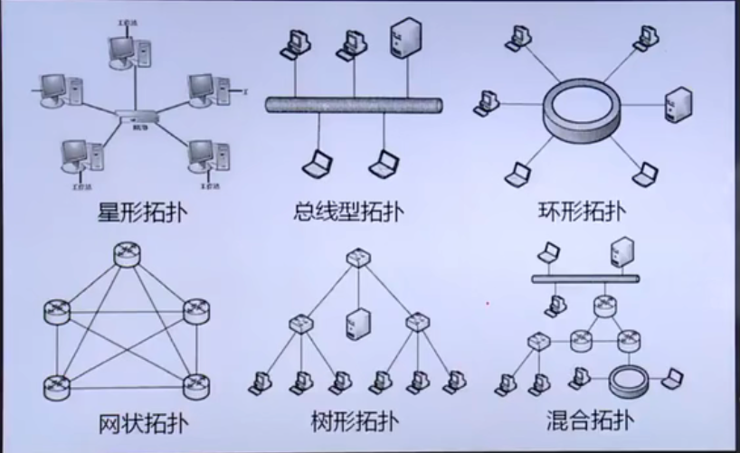

3、 按交换方式：电路交换网络、报文交换网络、**分组交换网络**

4、 按网络用户属性：公用网、私用网

### 二、计算机网络结构

计算机网络结构由外向内分成三层：网络边缘、接入网络、网络核心

#### 1.网络边缘

网络边缘就是连接到网络上的所有**端系统**，如平板、手机、PC等。

#### 2.接入网络

接入网络实现网络边缘的端系统和网络核心的连接与接入。

接入的方法：

1、电话拨号

2、非对称用户数字线ADSL

3、混合光纤同轴电缆HFC

4、局域网

5、移动接入网络

#### 3.网络核心

网络核心是由通信链路互连的分组交换设备构成的网络，作用是实现网络边缘中主机之间的数据中继和转发。

网络核心只是转发和中继数据、数据的处理在网络边缘。

### 三、数据交换技术

#### 1、数据交换概念

交换节点和通信介质的集合称为通信子网，即网络核心。

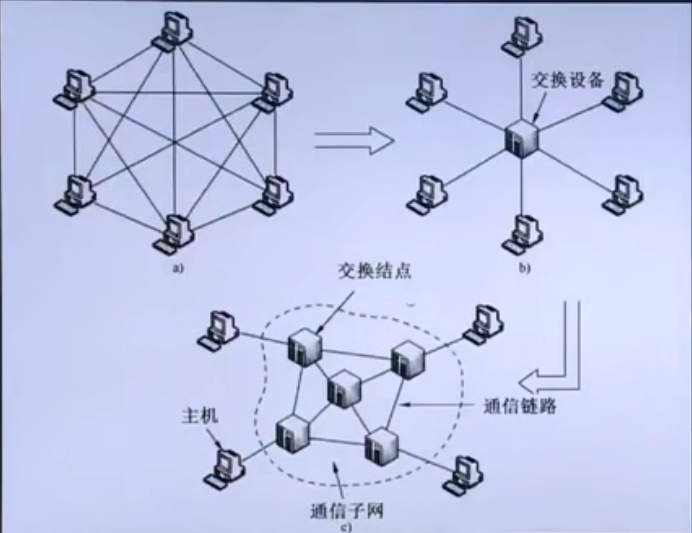

#### 2、电路交换

电路交换网络中，首先需要通过中间交换节点为两台主机之间建立一条**专用**的通信线路，称为电路，然后再利用该电路进行通信，通信结束后再拆除电路。

电路交换的优点：**实时性高**，时延和抖动较小。

电路交换的缺点：对于突发性数据传输，**信道利用率低**，传输速率单一。

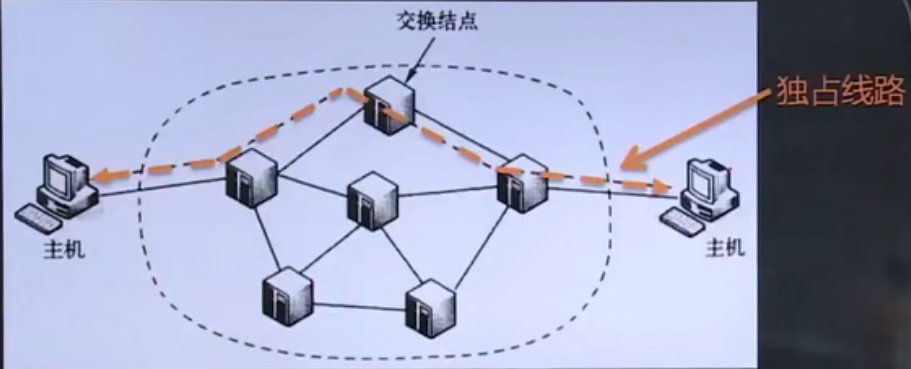

#### 3、报文交换

*以报文为单位*再交换网络的各节点之间以*存储-转发*的方式传送。

特点：

1. 不需要建立连接；

2. 只有当报文被转发时才占用相应的信道；

3. 交换节点需要缓冲存储，报文需要排队，增加了时延。

#### 4、分组交换

分组交换将一个完整的报文拆分成若干个分组，分组传输过程通常也是采用**存储-转发**交换方式。现代网络的数据传输靠的就是分组交换。

优点：
1、交换设备存储容量要求低；
2、交换速度快；
3、可靠传输效率高；
4、更加公平。

分组长度的确定：
1、分组长度与延迟时间
2、分组长度与误码率

### 四、计算机网络性能

#### 1、速率与带宽

**速率**是网络单位时间内传输的数据量，也称数据传输速率或数据速率。速率的基本单位是bit/s（位每秒）【或者是bps】。

在计网中，有时也会用**带宽**来描述速率。

带宽：原本指信号具有的**频带宽度**，即信号成分的最高频率与最低频率只差，单位是Hz（赫兹）。

#### 2、时延

时延是指数据从网络中一个节点（主机或者交换设备等）到达另一个节点所需要的时间。

分组的每跳传输过程主要产生4类时间延迟：
1、节点处理时延
2、排队时延
3、传输时延
4、传播时延

#### 3、时延带宽积

一段物理链路的传播时延与链路带宽的乘积。表示一段链路可以容纳的数据位数，也称为以位为单位的链路长度。

#### 4、丢包率

丢包率常被用于评价和衡量网络性能的指标，在很大程度上可以反映网络的拥塞程度。

丢包率=丢失分组总数/发送分组总数

#### 5、吞吐量

单位时间内源主机通过网络向目的主机实际送达的数据量。

经常英语度量网络的实际数据传送（通过）能力，即网络实际可以达到的源主机到目的主机的数据传送速率。

### 五、计算机网络体系结构（重点）

分层思想：计算机网络完成的所有功能可以划分成若干层，每层完成一部分子功能，每层在完成相应功能时与另一通信实体的相同层按照某种协议进行信息交换。

体系结构定义：计算机网络所划分的层次以及各层协议的集合称为计算机网络体系结构。

#### 1、OSI参考模型

OSI参考模型（开放系统互联参考模型），由高到低划分了七层：应用层、表示层、会话层、传输层、网络层、数据链路层、物理层。

OSI七层模型是国际化标准组织提出的，并没有被实际使用。

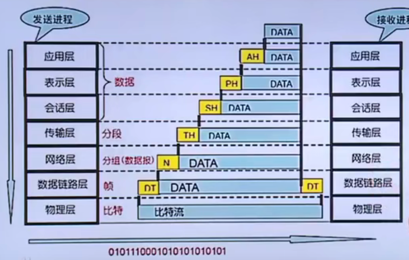

#### 2、TCP/IP参考模型

TCP/IP参考模型是现在使用的模型。被各大厂商实际商用的。从高到低分为四层：应用层、运输层、网际层、网络接口层。
四层对应七层的功能：
1、网络接口层对应了OSI数据链路层和物理层功能；
2、网际层对应的是OSI网络层；
3、运输层对应了OSI运输层；
4、应用层对应了OSI的应用层、表示层、会话层

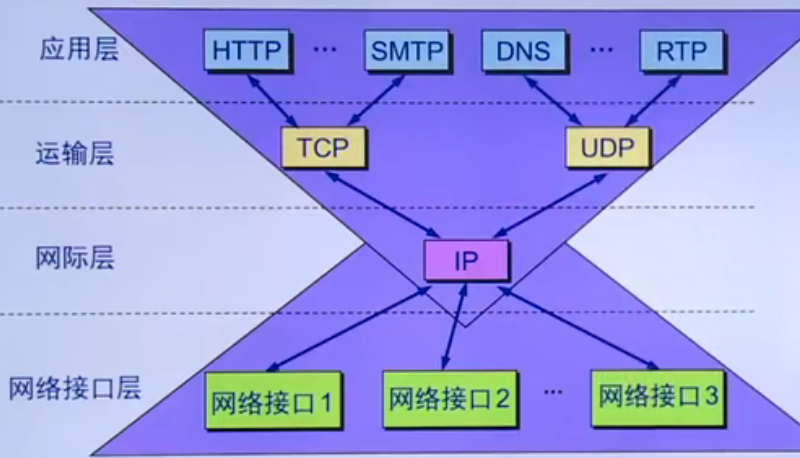

#### 3、五层参考模型

五层参考模型从高到低分为：应用层、传输层、网络层、链路层、物理层。

应用层的数据叫报文
传输层叫段
网络层叫数据报
链路层叫数据帧，简称帧
物理层叫比特流

在五层模型中，并不是每一个主机都要实现五层功能，可能只是实现其中某几层功能。如路由器实现了网络层、链路层、物理层三层。

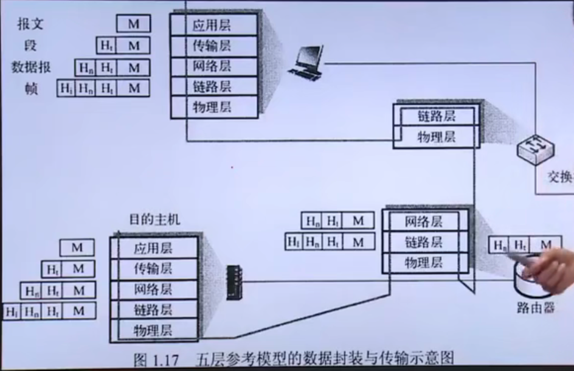

## 网络应用

### 一、计算机网络应用体系结构

1. 客户/服务器（C/S）结构
最主要的特征是通信只在客户与服务器之间进行，客户与客户之间不进行直接通信。

2. P2P（Peer to Peer）结构
每个对等端都同时具备C/S应用的客户与服务器特征，是一个服务器与客户的结合体，对等端之间直接通信。

3. 混合结构
既有中心服务器的存在，又有对等端（客户）间的直接通信。

### 二、网络应用通信基本原理

C/S通信基本原理：
- 服务器端运行服务器进程，被动等待客户请求服务；
- 客户端运行客户进程，主动发起通信，请求服务器进程提供服务。
- 应用进程间遵循**应用层协议**交换应用层报文。

### 三、域名系统（DNS）

#### 1.层次化域名空间

层次树状结构命名方法：
1. 国家顶级域名nTLD
2. 通用顶级域名gTLD
3. 基础结构域名

#### 2.域名服务器

1. 域名解析
将域名映射为IP地址的过程

2. 域名服务器
为了实现域名解析，需要建立分布式数据库存储网络中域名与IP地址的映射关系数据，这些数据存储在域名服务器上，域名服务器根据用户的请求提供域名解析服务。

3. 域名服务器分类：
根域名服务器
顶级域名服务器
权威域名服务器
本地域名服务器

#### 3.域名解析过程

1. 递归查询
代替查询主机或其他域名服务器，进行进一步的域名查询，并将最终解析结果发送给查询主机或服务器。递归查询有很大的性能问题。

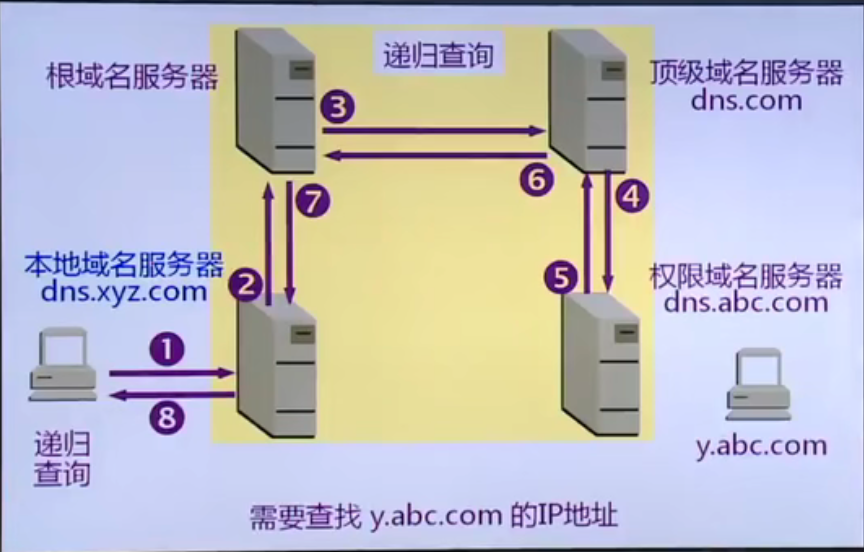

2. 迭代查询
只是将下一步要查询的服务器告知查询主机或服务器。

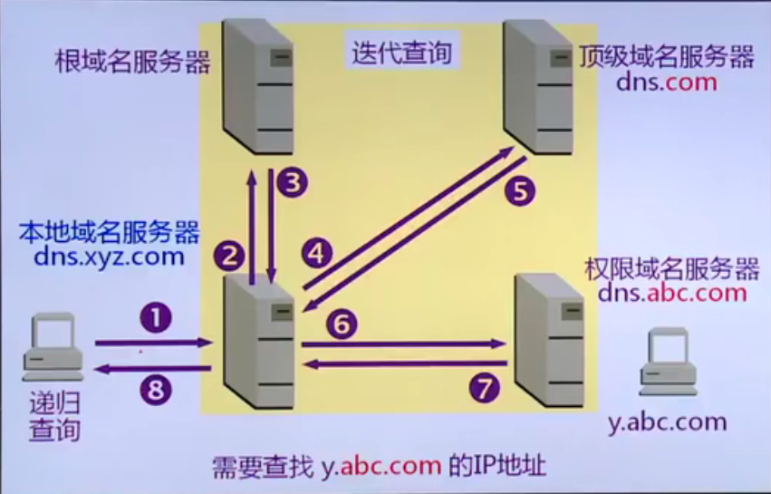

### 四、万维网应用

#### 1.万维网应用结构

Web服务器

浏览器

超文本传输协议HTTP

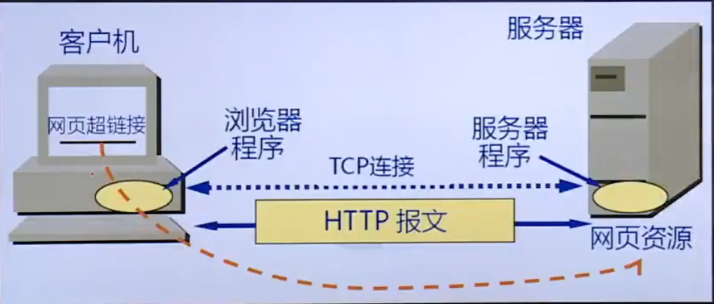

#### 2.HTTP

HTTP:超文本传输协议，定义浏览器如何向web服务器发送请求以及web服务器如何向浏览器进行响应。

版本：HTTP/1.0和HTTP/1.1

HTTP连接：非持久连接、持久连接

非持久连接串行方式请求每个对象，每次都需要重新建立TCP连接，效率较低。
非持久连接并行方式请求每个对象，每个对象都会建立一个TCP连接，同时处理多个TCP连接，可以提高效率，但要求设备能同时处理多个。

持久连接是建立一个TCP连接请求多个对象。分为流水型持久和非流水型持久连接。

非流水型持久连接建立一个TCP连接，一次请求一个对象（请求是按次序的，一次一个），当所有请求完成后断开连接，所有请求在一个TCP连接之上；

流水型持久连接建立一个TCP连接，除了获取页面请求是单独发出的，其余的请求几乎是同时发出的，响应也是如此。

HTTP报文：
请求报文——从客户端向服务器发送请求报文
响应报文——从服务器到客户的回答

请求报文格式：

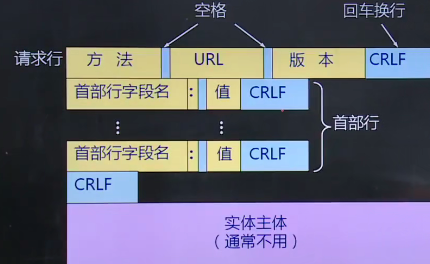

HTTP请求方法：典型的有GET、POST、HEAD、PUT、OPTION等。

GET：请求读取由URL所标识的信息。

POST：给服务器添加信息。

HEAD：请求读取由URL所标识的信息的首部，不需要再响应报文中包含对象。

PUT：再指明的URL下存储一个文档。

OPTION：请求一些选项的信息。

响应报文格式：

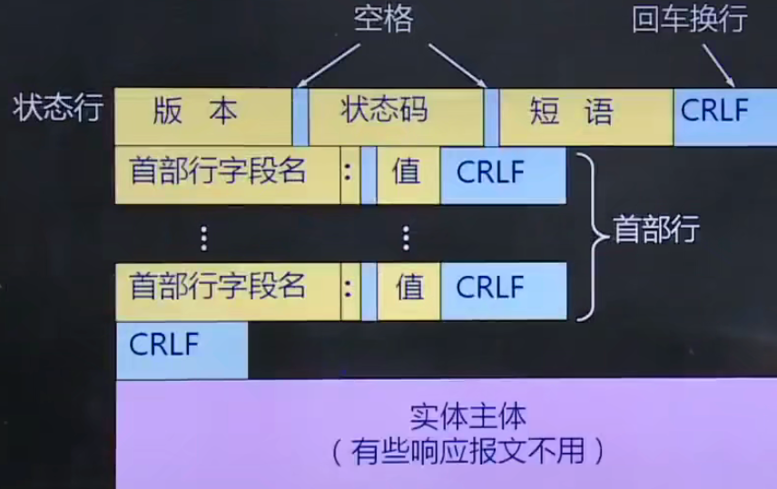

响应状态码：
| 状态码 | 作用 | 描述 |
| :--- | :--- | :--- |
| 1xx | 信息提示 | 通告信息，可能还有进一步交互 |
| 2xx | 成功 | 成功完成客户请求的操作，进行响应 |
| 3xx | 重定向 | 表示资源已移走，需要向新的URL发送请求 |
| 4xx | 客户端错误 | 客户端请求出错，无法成功响应 |
| 5xx | 服务器错误 | 服务器出错，无法成功响应 |

#### 3、Cookie

Cookie中文名称为小型文本文件，指某些网站为了辨别用户身份、进行会话跟踪而存储在用户本地终端上的数据。

弥补了HTTP协议无状态性的不足，有利于进行用户跟踪并提供针对性的服务，但也带来了一些安全问题。

cookie原理：
服务器端生成cookie，发送给浏览器；
浏览器将cookie保存到某个目录下的文本文件内；
下一次请求同一网站就发送该cookie给服务器；
服务器根据cookie值检索用户历史行为数据。

### 五、Internet电子邮件

#### 1、邮件系统组成

电子邮件系统主要包括邮件服务器、用户代理（收发邮件的软件）、简单邮件传输协议（SMTP）和邮件读取协议等。

#### 2、 SMTP协议

SMTP是Internet电子邮件中核心**应用层协议**，实现邮件服务器之间或用户代理到邮件服务器之间的邮件传输。

SMTP使用传输层**TCP**实现可靠数据传输，**端口号25**。

SMTP通过3个阶段的应用层交互完成邮件的传输，分别是**握手阶段、邮件传输阶段和关闭阶段**。

SMTP的基本交互方式是SMTP客户端发送命令，命令后面可以携带参数，SMTP服务器对命令进行应答。

#### 3、电子邮件格式与MIME

电子邮件包括首部、空白行、主体三部分。To，Subject，Cc，From，Date，Reply-To等关键词。

MIME（多用途互联网邮件扩展）将非7位ASCII码文本内容转换位7位ASCII码文本内容，然后利用SMTP进行传输。

在邮件首部增加MIME首部行说明主体内容原本的数据类型以及采用的编码标准等。

#### 4、邮件读取协议

第三版的邮局协议（Post Office Protocol-Version 3，POP3）

互联网邮件访问协议（Internet Mail Access Protocol,IMAP）

HTTP 
### 六、FTP

FTP（文件传输协议），在互联网的两个主机之间实现文件互传的应用层协议。

C/S模式采用**控制连接**（21端口）传输控制命令，**数据连接**（20端口）传输文件内容

### 七、P2P应用

P2P应用（点对点应用，对等应用）的优势：充分聚集利用了端系统（对等方主机）的计算能力以及网络传输带宽，对服务器的依赖很小。

### 八、Socket编程基础

Socket接口模型：
网络应用进程通信时需要通过API接口请求底层协议的服务。可以创建数据报类型套接字SOCK_DGRAM、流式套接字SOCK_STREAM和原始套接字SOCK_RAW.

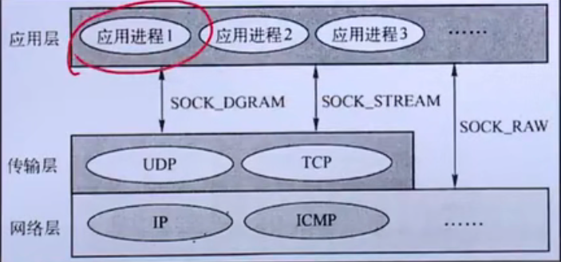

## 传输层

### 一、传输层的基本服务

#### 1.传输层功能

核心任务是为应用进程之间提供**端到端的逻辑通信服务**。

主要功能包括：
* 传输层寻址；
* 应用层报文的分段与重组
* 报文的差错检测
* 进程间端到端可靠数据传输控制
* 面向应用层实现复用与分解
* 端到端的流量控制
* 拥塞控制

传输层协议提供**逻辑通信**服务，只需要在**端系统**中实现。
通信的真正端点并不是主机，而是主机中运行的**应用进程**。

#### 2.传输层寻址与端口

1. 用统一的寻址方法对应用进程进行标识————**端口号**
2. 在全网范围内利用**IP地址+端口号**唯一标识一个通信端点（应用进程）。
3. 传输层端口为16位二进制整数，包含三类端口：
  - **熟知端口号**，数值为0~1023
  - **登记端口号**，数值为1024~49151,为没有熟知端口号的应用程序使用。使用这个范围的端口号必须在IANA登记，防止重复。
  - **客户端口号或者短暂端口号**，数值为49152~65535，留给客户进程选择暂时使用。这种端口是不固定的，需要时临时申请。

#### 3.无连接服务与面向连接服务

无连接服务：数据传输之前无需与对端进行任何信息交换（即握手），直接构造传输层报文段并向接收端发送————UDP。

面向连接服务：在数据传输之前，需要双方交换一些控制信息，建立**逻辑连接**，然后再**传输数据**，数据传输结束后需要**拆除连接**————TCP。

### 二、传输层的复用与分解

多路复用与多路分解是传输层的一项基本功能，支持众多应用进程共用同一个传输层协议，并能够将接收到的数据准确交付给不同的应用进程。

#### 1.无连接的多路复用与多路分解

UDP套接字：<目的IP地址，目的端口号>

UDP套接字的端口号是UDP实现复用与分解的重要依据。

#### 2.面向连接的多路复用与多路分解

TCP套接字（标识一条TCP连接）：<源IP地址，源端口号，目的IP地址，目的端口号>

当一个TCP报文段从网络层到达一台主机时，该主机根据4个值将报文段分解到相应的套接字。
### 三、停——等协议与滑动窗口协议

#### 1.可靠数据传输基本原理

1. 差错检测：利用差错编码实现数据包传输过程中的比特差错检测。

2. 确认：接收方向发送方反馈接收状态。

3. 重传：发送方重新发送接收方没有正确接收的数据。

4. 序号：确保数据按序提交。

5. 计时器：解决数据丢失问题。

#### 2.停-等协议

停-等协议的主要特点就是每发送一个报文段后就停下来等待接收方确认。

基本工作过程：
1. 发送方发送经过差错编码和编号的报文段，等待接收方确认；（**发送并等待确认**）
2. 接收方如果正确接收报文段，即差错检测无误且序号正确，则接收报文段，并向发送方发送ACK，否则丢弃报文段，并向发送方发送NAK；（**接受并确认/否认**）
3. 发送方如果收到ACK，则继续发送后续报文段，否则重新发送刚刚发送的报文段。（**继续发送/重发**）

停-等协议**降低了信道利用率，影响性能**。

解决方法：**流水线协议或管道协议——运行发送方再没有收到确认前连续发送多个分组。**

流水线协议可以改进：
**增加分组序号范围**;
**发送方和（或）接收方必须缓存多个分组。**

典型的流水线协议：**滑动窗口协议**

#### 3.滑动窗口协议

两种最具代表性的滑动窗口协议：回退N步（Go-Back-N，GBN）协议和选择重传（Selective Repeat，SR）协议。

GBN协议：发送端窗口较大，可以再未得到确认前连续发送多个分组，但接收窗口仅为1，只能接收1个按序到达的分组，未按序到达的分组或者某个分组差错，就会引起发送方重发该分组及其后的所有分组。

SR协议：增加接收方缓存能力（接收窗口>1），缓存正确到达但失序的分组，仅要求发送方重传未被接收方确认的分组，等缺失分组到达后一并向上层按序提交。

### 四、用户数据报协议（UDP）

用户数据报协议UDP是Internet传输层协议，提供**无连接、不可靠**、数据报尽力传输服务。

#### 1.UDP数据报结构

源和目的端口号：用于UDP实现复用与分解。

长度字段：在UDP报文段中的字节数（首部和数据的总和）。

校验和：接收方用来检测该报文段是否出现了差错。

#### 2.UDP校验和

计算校验和：

1. 对所有参与运算的内容（包括UDP报文段）按16位（16位对齐）求和；

2. 求和过程中遇到的任何溢出（进位）都被回卷（即进位与和的最低位再加）；

3. 最后得到的和取反码。

### 五、传输控制协议（TCP）

#### 1.TCP报文结构

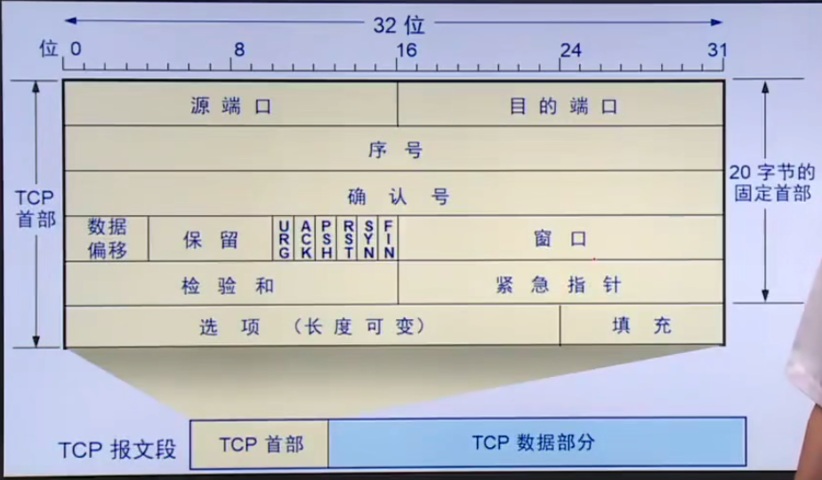

#### 2.TCP连接管理

建立连接——三次握手：
1. SYN连接请求
2. SYNACK确认
2. ACK确认

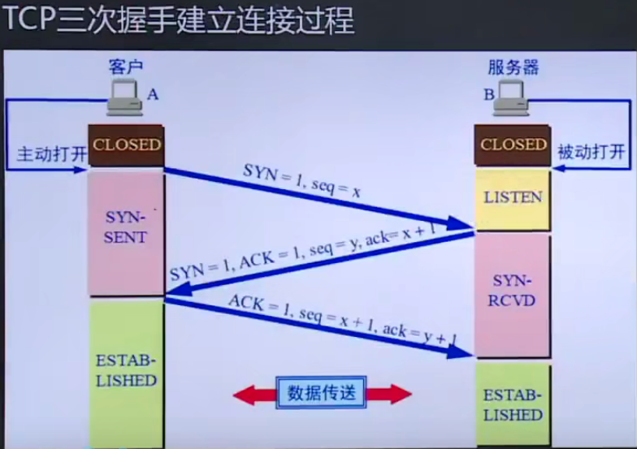

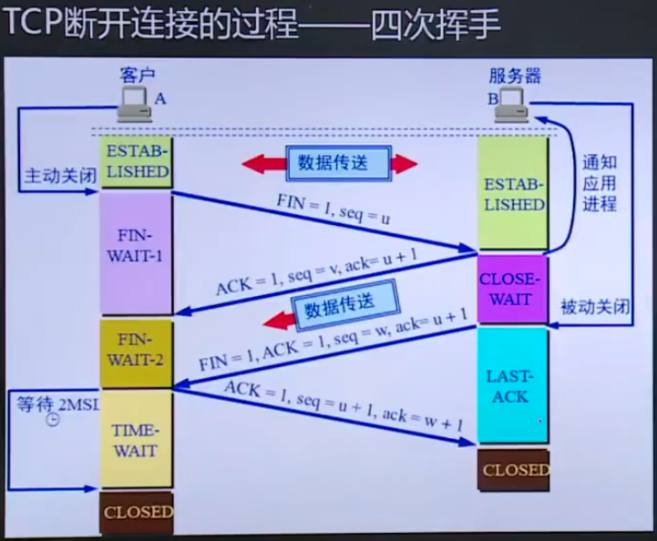

#### 3.TCP可靠数据传输

1. TCP的可靠数据传输实现机制包括差错编码、确认、序号、重传、计时器等。

2. TCP的可靠数据传输是基于滑动窗口协议，但是发送窗口大小动态变化。
  - 封装TCP报文段
  - 发出一个报文段后启动一个计时器
  - 通过校验和发现数据差错
  - 通过序号重新排序，丢弃重复的报文段
  - 流量控制

#### 4.TCP流量控制

1. TCP协议利用窗口机制实现流量控制，但不是简单的滑动窗口协议。

2. TCP建立连接时，双方都为之分配了固定大小的缓冲空间。TCP的接收端只允许另一端发送其缓冲区所能接纳的数据。
  - 接收端再给发送端发送确认段时，通过接收窗口大小
  - 发送端在接下来发送数据段时，确保未确认段的应用层数据总量不超过接收端通告的接收窗口大小，从而确保接收端不会发生缓存溢出。

#### 5.TCP拥塞控制

1. 窗口机制：通过调节窗口的大小实现对发送数据速率的调整。

2. 窗口调整的基本策略：AIMD
  加性增加，乘性减小；
  网络未发生拥塞时，逐渐加性增大窗口大小，当网络拥塞时，乘性快速减小窗口大小。

3. TCP的拥塞控制算法：包括了慢启动、拥塞避免、快速重传和快速恢复四部分。

## 网络层
### 一、网络层服务

网络层的主要作用是将网络层数据报从**源主机**送达**目的主机**。

主要功能包括：

1. 转发：分组从输入接口转移到输出接口
2. 路由选择：决定分组经过的路由或路径

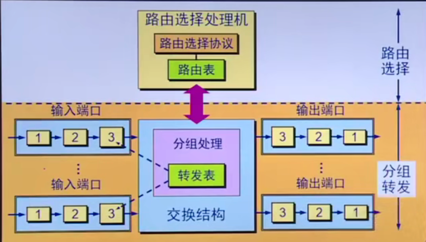

### 二、数据报网络与虚电路网络

#### 1.数据报网络

数据报网络：按照目的主机地址进行路由选择的网络。

特点：

1. 无连接；
2. 每个分组作为一个独立的数据报进行传送，路径也可能不同；
3. 分组可能出现乱序和丢失。

#### 2.虚电路网络

虚电路网络在网络层提供面向连接的分组交换服务。

特点：

1. 建立一条网络层逻辑连接；
2. 不需要为每条虚电路分配独享资源（区别于电路交换）；
3. 根据虚电路号沿虚电路路径按序发送分组。

### 三、网络互连与网络互联设备

#### 1.异构网络互联

异构网络：两个网络的通信技术和运行的协议不同。

异构网络互联的基本策略：

1. 协议转换；
2. 构建虚拟互联网络（比如都基于IP协议构建虚拟网络）

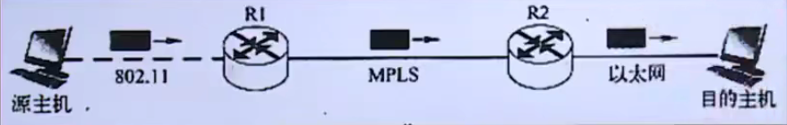

#### 2.路由器

交换结构：

1. 基于内存交换
2. 基于总线交换
3. 基于网络交换

路由处理器：执行路由器的各种指令，包括路由协议的运行、路由计算以及路由表的更新维护等。

### 四、网络层拥塞控制

#### 1.网路拥塞

拥塞：一种持续过载的网络状态，此时用户对网络资源（包括链路带宽、存储空间和处理器处理能力等）的总需求超过了网络固有的容量。

原因：

1. 缓冲区容量有限；
2. 传输线路的带宽有限；
3. 网络结点的处理能力有限；
4. 网络中某些部分发生了故障。

#### 2.流量感知路由

流量感知路由：根据网络负载动态调整，将网络流量引导到不同的链路上，均衡网络负载，从而延缓或避免拥塞发生。

解决网络负载的震荡现象：

1. 多路径路由；
2. 缓慢转移流量到另一链路。

#### 3.准入控制

准入控制：一种广泛应用于虚电路网络的拥塞预防技术。

基本思想：对新建虚电路进行审核，如果新建立的虚电路会导致网络变得拥塞，那么网络拒绝建立该新虚电路。

拥塞状况的量化：基于平均流量和瞬时流量。

#### 4.流量调节

1. 感知拥塞；
2. 处理拥塞：将拥塞信息通知到其上游结点。处理方法：
 - 1. 抑制分组：给拥塞数据报的**源主机**返回一个抑制分组
 - 2. 背压：让抑制分组在从拥塞结点到源结点的路径上的**每一跳**都发挥抑制作用。

#### 5.负载脱落

负载脱落：路由器主动丢弃某些数据报。

如何选择要丢弃的数据报：

1. 丢弃新分组：如GBN
2. 丢弃旧分组：如实时视频流

### 五、Internet网络层

#### 1.IPv4协议

IP数据报格式：
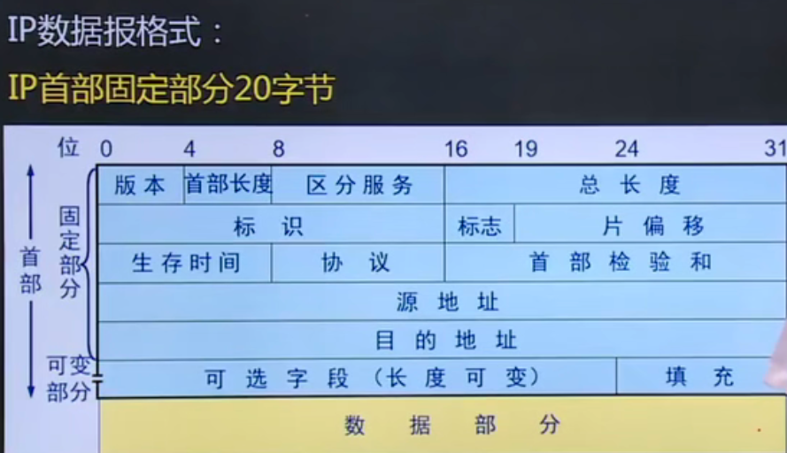

IP数据报分片：

标识：判断这些分片是否属于同一个IP数据报

标志：判断是否为最后一个分片

片偏移：判断各分片的先后顺序

#### 2.IPv4编址

IPv4地址长度：32位二进制，用点分十进制标记法标记。

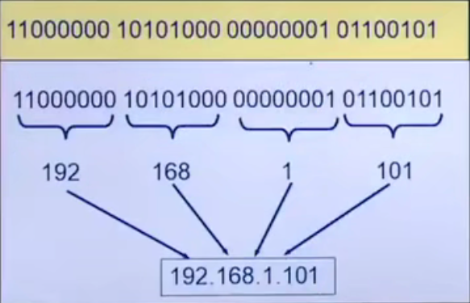

IP地址分为5类：A、B、C、D、E

其中，ABC三类地址是分配给每台上网的主机（终端）使用的。
DE两类地址是不分配给主机使用的。
D类是多播地址，E类是保留地址，留给以后使用。

ABC三类IP地址的每一个IP分为两部分：网络号和主机号。
网络号表示IP地址所在的网络编号，主机号是主机编号。同类IP地址的网络编号是相同的。

A类地址前8位是网络号，主机号有24位；
B类地址前16位是网络号，主机号后16位；
C类地址前24位是网络号，主机号后8位；

判断IP地址属于哪一类可以通过IP地址的最高几位：
最高位是0，则是A类地址；
最高两位是10.则是B类地址；
最高三位是110，则是C类地址。
最高4位是1110，是D类地址。
最高4位是1111，是E类地址。

A类地址的网络号取值范围[0,127]，主机号有 2^24 个，其中，全0和全1这两个不分配给主机使用，所以能分配给主机使用的地址有 2^24-2 个。

B类地址的网络号取值范围[128,191]，主机号有 2^16 个，能分配给主机使用的地址有 2^16-2 个，同样全0和全1不能使用。

C类地址的网络号取值范围[192,223],主机号有 2^8 个，能分配给主机使用的地址有 2^8 -2 个，同样全0和全1不能使用。

子网划分：
将一个较大的子网划分成多个较小子网的过程。
较大子网有较短的网络前缀，较小的子网有稍长的前缀。

同一个子网，网络号是相同的（网络前缀相同），不同的只是主机号。

超网：将具有较长前缀的相对较小的子网合并成一个具有稍短前缀的相对较大的子网。

子网掩码：用来定义一个子网的网络前缀长度。子网掩码前部分全1，后部分全0。

子网地址=IP地址 ^ 子网掩码

划分子网的方法就是延长网络前缀。子网掩码延长r位，子网将被划分为2^r个。

分组转发：
查找路由表；
最长前缀匹配原则。

路由聚合：将相同路由的连续子网合并。

#### 3.动态主机配置协议

动态主机配置协议——DHCP：为网络内的主机提供动态IP地址分配服务。

DHCP服务器发现
DHCP服务器提供
DHCP服务器请求
DHCP确认

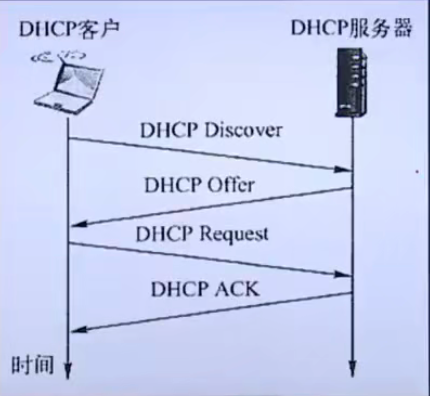

#### 4.网络地址转换

网络地址转换NAT——使用私有地址访问互联网

1. 从内网进入互联网的IP数据报：将其源IP地址替换成NAT服务器拥有的合法公共IP地址，同时替换源端口号，并将替换关系记录到NAT转换表中；

2. 从互联网返回的IP数据报：依据其目的IP地址与目的端口号检索NAT转换表，得到内部私有IP地址与端口号，替换目的IP地址和目的端口号，然后将IP数据报转发到内部网络。

#### 5.ICMP

互联网控制报文协议（ICMP）：在主机或路由器间实现差错信息报告。

ICMP差错报告报文有五种：终点不可达、源点抑制、时间超时、参数问题和路由重定向。

ICMP询问报文：回声（echo）请求/应答、时间戳（timestamp）请求/应答。

#### 6.IPv6

解决IPv4地址耗尽的问题

IPv6报文首部长度固定40字节

IPv6地址长度128位

IPv4到IPv6的迁移：
- 双协议栈；
- 隧道

### 六、路由算法与路由协议

#### 1.链路状态路由选择算法

链路状态路由选择算法是一种全局式路由选择算法。

每个路由器通过从其它路由器获得的链路状态信息构建出整个网络的拓扑图。

计算最短路径——Dijkstra算法

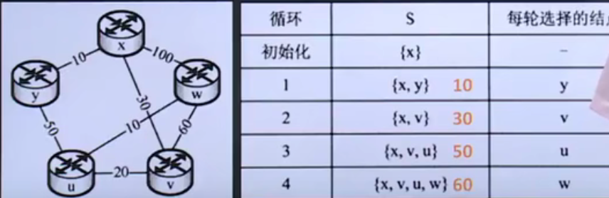

#### 2.距离向量路由选择算法

每个结点基于其**与邻居结点间的直接链路距离**，以及**邻居交换过来的距离向量**，计算并更新其到达每个目的结点的最短距离，然后将新的距离向量再通告给其所有邻居，直到距离向量不再改变。

Bellman-Ford方程：

#### 3.层次化路由选择

实现大规模网络路由选择最有效、可行的解决方案是划分自治系统：
- 网关路由器
- 自治系统间路由协议

#### 4.Internet路由选择协议

1. 内部网关协议：
- RIP：基于距离向量路由选择算法，跳数作为距离度量，最大距离不超过15跳，每30秒交换一次距离向量。
- OSPF：基于链路状态路由选择算法。

2. 外部网关协议：BGP

## 数据链路层与局域网

### 一、数据链路层服务

链路：通信链路连接的相邻结点的通信信道。

链路层数据单元：帧

主要功能：
1. 组帧
2. 链路接入：点对点链路、广播链路
3. 可靠交付（可靠传输方法多用于高出错率链路）
4. 差错控制

### 二、差错控制

#### 1.差错控制的基本方式

1. 检错重发
2. 前向纠错，接收端进行差错纠正
3. 反馈校验，接收端将收到的数据原封不动发回发送端
4. 检错丢弃

#### 2.差错编码的基本原理

香浓信道编码定理：理论上可以通过编码使得数据传输过程不发生错误，或者将错误概率控制再很小的数值之下。

#### 3.差错编码的检错与纠正能力

汉明距离：两个等长码字之间，对应位不同的位数。

编码集的汉明距离：改编码集中任意两个码字之间汉明距离的最小值。
差错编码的检错与纠错能力与编码集的汉明距离有关。

1. 检错编码：如果编码集的汉明距离Ds=r+1,则该错编码可以检测r位的差错。

2. 纠错编码：如果编码集的汉明距离Ds=2r+1，则该差错编码可以纠正r位的差错。

#### 4.典型的差错编码

1. 奇偶校验码：
- 奇校验：编码后的码字中1的个数位奇数
- 偶校验：编码后的码字中1的个数位偶数

2. 汉明码：可以实现单个比特差错纠正

3. 循环冗余码CRC：检错能力强，编码效率高，实现简单。

### 三、多路访问控制协议

#### 1.信道划分MAC协议

多路访问控制MAC：广播信道上用于协调各个结点的数据发送。

信道划分MAC协议：
1. 频分多路复用：再频域内将信道带宽划分为多个子信道。
2. 时分多路复用：将信道的传输信号在时域内划分为多个等长的时隙。
3. 波分多路复用：在一根光纤中，传输多路不同波长的光信号。
4. 码分多路复用：从编码域进行划分，使得编码后的信号在同一信道中混合传输。

#### 2.随机访问MAC协议

1. ALOHA协议
纯ALOHA：直接发送 ——> 信道侦听 ——> 冲突重发
时隙ALOHA：时隙开始时发送 ——> 信道侦听 ——> 冲突则下一时隙以概率P重发

2. 载波监听多路访问协议CSMA
**发送前监听信道是否空闲**
- 非坚持CSMA：忙则等待随机时间后再侦听
- 1-坚持CSMA：忙则持续侦听
- P-坚持CSMA：闲则概率P再最近时隙发送

3. 带冲突检测的载波监听多路访问协议CSMA/CD
监听空闲后发送，发送时检测碰撞，碰撞后等待重发

#### 3.受控接入MAC协议

1. 集中式控制
由一个主机负责调度其他通信站接入信道，从而避免冲突。
主要方法：轮询技术，又分为伦叫轮询和传递轮询。

2. 分散式控制
典型方法：令牌技术，比如令牌环网。

### 四、局域网

#### 1.数据链路层寻址与APR

1. MAC地址：
每一个接口对应一个MAC地址，且全球唯一；
长度48位。

2. 地址解析协议ARP：
根据本网内目的主机或默认网关的IP地址获取MAC地址；
查询/响应的方式。

#### 2.以太网
1. IEEE802.3标准
2. 采用CSMA/CD访问控制方法
3. 以太网技术：
- 10Base-5，10Base-T
- 快速以太网100Base-TX，100Base-T4，100Base-FX
- 千兆以太网
- 万兆以太网

#### 3.交换机

1. 转发与过滤：可以依据接收到的链路层帧的目的MAC地址，选择性地转发到相应的端口。
2. 自学习：交换机通过自学习构建交换表。
3. 优点：
- 消除冲突，提高性能；
- 支持异质链路；
- 易于进行网络管理。

#### 4.虚拟局域网VLAN

1. 一种基于交换机（支持VLAN功能）的逻辑分割广播域的局域网应用形式。

2. 不受物理位置的限制，以软件的方式划分和管理局域网中的工作组。

3. 能够抑制广播风暴。

4. 划分方法：
- 基于交换机端口
- 基于MAC地址
- 基于上层协议类型或地址

### 五、点对点链路协议

#### 1.PPP协议

点对点协议（PPP）：能够处理差错检测、支持多种上层协议、允许连接时协商IP地址、允许身份认证。

典型应用：拨号上网

功能：
- 成帧
- 链路控制协议LCP
- 网络控制协议NCP

#### 2.HDLC协议

高级数据链路控制——HDLC协议：可应用于点对点链路和点对多点链路。

帧定界：帧的定界符是01111110

位填充：（透明传输）
发送端只要发现数据字段5个连续的1就立即插入一个0，保证数据字段不会出现连续的6个1；
接收端发现数据流中5个连续的1就删除其后的一个0，还原成原来的信息。

## 物理层

### 一、数据通信基础

#### 1.数据通信基本概念

消息：人类能够感知的描述称为消息。

信息：信息是对事物状态或存在方式的不确定性表述，**信息是可以度量的**。

通信：本质就是再一点精确或近似地再生另一个点的信息。

通信系统：能够实现通信功能的各种技术、设备和方法的总体。

信号：通信系统中，再传输通道中传播的信息的**载体**。

数据：对客观事物的性质状态以及相互关系进行记载的**符号**及其组合。

信道：以传输介质为基础的信号通道。

#### 2.数据通信系统模型

通信系统的构成：信源、发送设备、信道、接收设备、新宿和噪声源等部分。
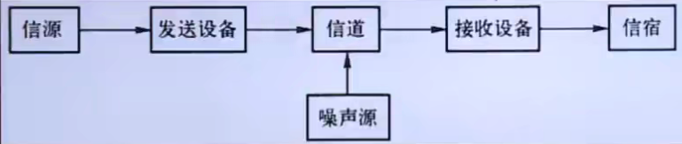

模拟通信——模拟信号：信号的应变量是连续的。
数字通信——数字信号：应变量是离散的。
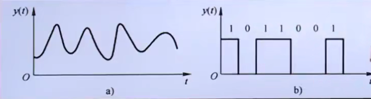

数据通信方式：
1. 单向通信、双向交替通信和双向同时通信；
2. 并行通信和串行通信；
3. 异步通信和同步通信。

数据通信系统的功能：
1. 信道利用；
2. 接口及信号产生；
3. 同步；
4. 差错检测与纠正；
5. 寻址与路由；
6. 网络管理；
7. 安全保证。
### 二、物理介质

#### 1.导引型传输介质（有线）

架空明线：平行且相互分离或绝缘的架空裸线线路，通常采用铜线或铝线等金属导线。

双绞线：两根相互绝缘的铜线并排绞合在一起，减少相邻导线的电磁干扰。
双绞线分为屏蔽双绞线STP和非屏蔽双绞线UTP（使用率更广泛，价格低）。两者的区别是有无屏蔽层。

同轴电缆：抗电磁干扰性能号。现在主要用于频带传输，如有线电视。

光纤：基本原理是利用光的全反射。通信容量大、距离远、抗电磁干扰性能好、保密性强。分为多模光纤和单模光纤。（现在主要使用）

#### 2.非导引型传输介质（无线）

地波传播：低频信号，沿地球表面传播。

天波传播：较高频信号，利用电离层的反射传播。

视波传播：高频信号，点对点直线传播，中继传输。

### 三、信道与信道容量

#### 1.信道分类与模型

狭义信道：信号传输介质

广义信道：信号传输介质和通信系统的一些变换装置。
- 调制信道：信号从调制器的输出端传输到解调器的输入端经过的部分。
- 编码信道：数字信号由编码器输出端传输到译码器输入端经过的部分。

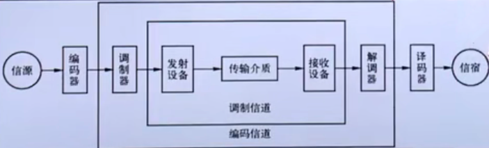

#### 2.信道传输特性

恒参信道：各种有线信道和部分无线信道，传输特性变化小、缓慢，如微波视线传播链路和卫星链路等。
- 对信号幅值产生固定的衰减；
- 对信号输出产生固定的时延。

随参信道：传输特性随时间随机快速变化。
- 信号的传输衰减随时间随机变化；
- 信号的传输时延随时间随机变化；
- 存在多径传播现象。

#### 3.信道容量

信道容量是指信道无差错传输信息的最大平均信息速率。分为连续信道容量和离散信道容量。

连续信道容量：
理想无噪声信道的信道容量，奈奎斯特公式：C=2Blog2 M 。
有噪声连续信道的信道容量，香农公式：C=Blog2 （1+S/N）。

### 四、基带传输

#### 1.基带传输基本概念

模拟基带信号：模拟信源发出的原始电信号。

数字基带信号：数字信源发出的基带信号。

模拟基带信号可以通过信源编码转换为数字基带信号。

基带传输：直接在信道中传送基带信号。

数字基带传输系统：
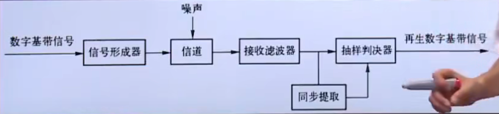

#### 2.数字基带传输编码

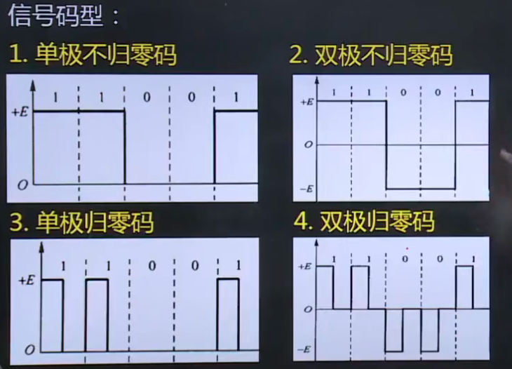
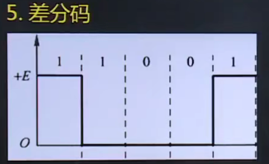

基带传输码型：
- AMI码：信号交替反转码
零电频编码二进制信息0，二进制信息1（传号）则交替用正电平和负电平表示。
- 双向码：曼彻斯特码
正（高）电平跳到负（低）电平表示1，负电平跳到正电平表示0。
- 米勒码
- CMI码
- nBmB码
- nBmT码

### 五、频带传输

#### 1.频带传输基本概念

数字调制：利用数字基带信号控制载波信号的某些特征参量，使载波信号的这些参量的变化反映数字基带信号的信息，进而将数字基带信号变换为数字通带信号的过程。

键控法：利用两种不同的幅值、频率或相位来分别表示0或1。

#### 2.频带传输中的三种调制方式

1. 二进制数字调制
- 二进制幅移键控：载波信号幅值随基带信号变化
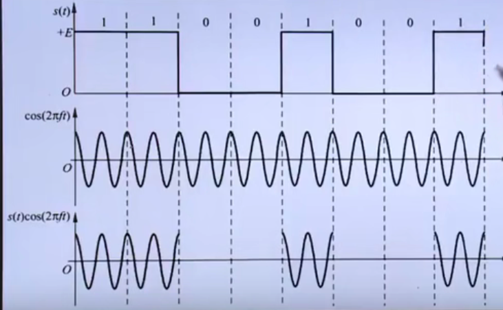
- 二进制频移键控：随基带信号变化而选择不同频率载波信号
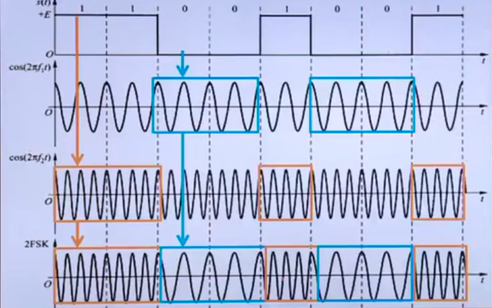
- 二进制相移键控：载波信号相位随基带信号变化
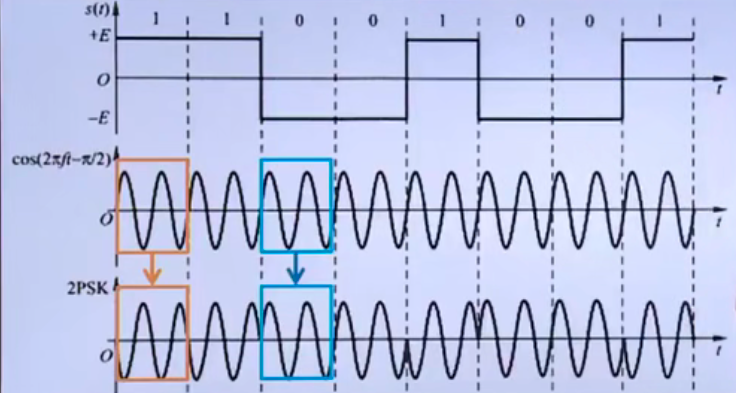
- 二进制差分相移键控：基带信号控制相邻码元载波相对相位是否变化，1：相对相位改变；0：相对相位不变。
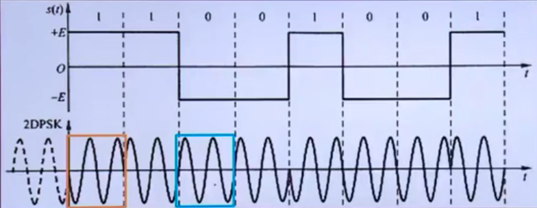

2. 多进制数字调制

3. 正交幅值调制QAM

### 六、物理层接口规程

#### 1.物理层接口概述

物理层接口的四大特性：机械特性、电气特性、功能特性、规程特性。

物理层接口规范定义DTE和DCE之间的接口特性：
- DTE：数据终端设备
- DCE：数据电路端接设备

#### 2.物理层接口特性

机械特性：通信实体间硬件连接接口的机械特点。

电气特性：在物理连接上，导线的电气连接及有关电路的特性。

功能特性：物理接口各条信号线的用途。

规程特性：通信协议，指明利用接口传输比特流的全过程，以及个项用于传输的事件发生的合法顺序。

## 无线与移动网络
### 一、无线网络
#### 1.无线网络基本结构

1. 无线主机
2. 无线链路
3. 基站
4. 网络基础设施
5. 自组织网络（Ad Hoc网络）

#### 二、无线链路与无线网络特性

无线链路与有线链路的主要区别：
- 信号强度的衰减
- 干扰
- 多径传播
- 隐藏终端

### 二、移动网络
#### 1.移动网络基本原理

1. 不同的移动性需求
2. 网络地址保持不变的重要性
3. 有线基础设施的支持

#### 2.寻址
永久地址和转交地址
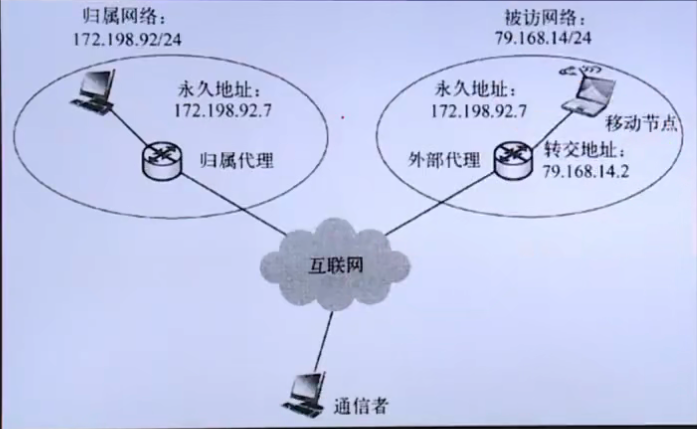

#### 3.移动网络路由选择

1. 间接路由选择：由归属代理转发给外部代理。（移动网络路由主要方案）
2. 直接路由选择：由通信代理获得转交地址，直接发送带外部代理。

### 三、无线局域网IEEE 802.11
#### 1.IEEE802.11体系结构
1. 基站AP
2. 基本服务集BSS

AP发现：
- 主动扫描探测帧
- 被动扫描信标帧

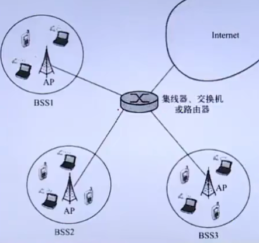

#### 2.IEEE802.11的MAC协议

CSMA/CA——带碰撞避免的CSMA：通过RTS和CTS的交换，可以实现信道的预约占用，避免数据帧传输过程中的冲突。

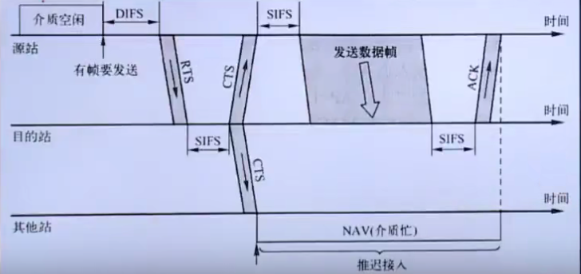

#### 3.IEEE802.11帧

IEEE802.11的帧类型：控制帧、数据帧和管理帧。

MAC首部：长度30字节，包括4个地址字段（主要使用目的的地址、源地址、AP地址）。

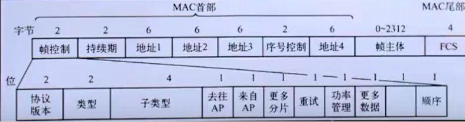

### 四、蜂窝网络

#### 1.蜂窝网络体系结构

基站系统BSS：基站控制器、收发基站

移动交换中心MSC

网关MSC

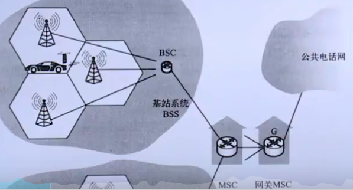

#### 2.蜂窝网络中的移动性管理

间接路由选择方法
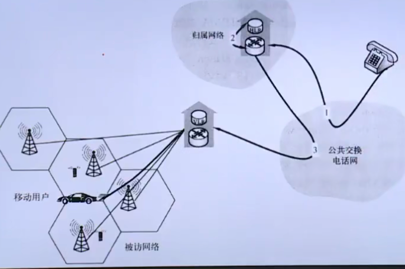

#### 3.移动通信2G-5G网络

2G：信令和语音信道都是数字式的。

3G：无线通信与互联网等多媒体通信结合。

4G：高速率数据业务，不同频段、不同业务环境间的无缝漫游。

5G：超高容量、超可靠性、随时随地可接入性。

### 五、移动IP网络

#### 1.代理发现

代理通告：外部代理或归属代理使用一种现有路由器发现协议的扩展协议来通告其服务。周期性地在所有连接的链路上广播一个类型字段为9（路由器发现）的ICMP报文。

代理请求：移动结点广播一个代理请求报文，该报文是一个类型值为10的ICMP报文。收到该请求的代理将直接向该移动结点单播一个代理通告。

#### 2.向归属代理注册

移动结点和/或外部代理向一个移动结点的归属代理注册或注销COA所使用的协议。

1. 移动节点向外部代理发送一个移动IP注册报文；
2. 外部代理记录移动结点的永久IP地址，并发送注册请求给归属代理；
3. 归属代理接收注册请求并发送注册应答；
4. 外部代理接收注册应答，然后将其转发给移动结点。

### 六、其他典型无线网络简介

WiMax:IEEE802.16,城域网技术，传输距离更远，接入带宽更高。

蓝牙：IEEE802.15.1，范围小，低功率，低成本，自组织。

ZigBee：IEEE802.15.4，低功率，低数据率，低工作周期。

## 网络安全

### 一、网络安全概述

#### 1.基本概念

网络安全通信所需要的基本属性：
- 机密性
- 消息完整性
- 可访问与可用性
- 身份认证

#### 2.网络安全威胁

- 窃听
- 插入
- 假冒
- 劫持
- 拒绝服务DoS和分布式拒绝服务DDoS
- 映射
- 嗅探
- IP欺骗

### 二、数据加密

明文：未加密的消息。

密文：被加密的消息。

加密：伪装消息以隐藏消息的过程（明文转变为密文的过程）。

解密：密文转变为明文的过程。

#### 1.传统加密方式

1. 替代密码：用密文字母代替明文字母。
移位密码加密函数：E_k (M)=(M+k)  mod q （下划线后的字母表示下标）。
解密函数：D_k (C)=(K-k)  mod q （下划线后的字母表示下标）。

2. 换位密码：根据一定的规则重新排列明文。

#### 2.对称密钥加密

现代密码分类：
- 对称密钥密码：加密密钥和解密密钥相同（密钥保密）。
- 非对称密钥密码：加密密钥和解密密钥不同

对称密钥密码分类：
- 分组密码：DES、AES、IDEA等。
- 流密码。

1. DES：56位密钥，64位分组。
2. 三重DES：使用两个密钥共112位，执行三次DES算法。
3. AES：分组128位，密钥128/192/256位。
4. IDEA：分组64位，密钥128位。

#### 3.非对称/公开密钥加密

密钥成对使用，其中一个用于加密，另一个用于解密，加密密钥可以公开，也称为公开密钥加密。

典型的公钥算法：
- Diffie-Hellman算法
- RSA算法

### 三、消息完整性与数字签名

#### 1.消息完整性检测

密码散列函数：
- 定长输出；
- 单项性（无法根据散列值逆推报文）；
- 抗碰撞性（无法找到具有相同散列值的两个报文）。

典型散列函数：
- MD5：128位散列值
- SHA-1：160位散列值

#### 2.报文认证

报文认证是使消息的接收者能够检验收到的消息是否是真实（来源真实、未被篡改）的认证方法。

1. 报文摘要（数字指纹）
2. 报文认证方法：
- 简单报文验证：仅使用报文摘要，无法验证来源真实性。
- 报文认证码：使用共享认证密钥，但无法防止接收方篡改。

#### 3.数字签名

身份认证、数据完整性、不可否认性

1. 简单数字签名：直接对报文签名
2. 签名报文摘要

### 四、身份认证

口令：会被窃听

加密口令：可能遭受回放（重放）攻击

加密一次随机数：可能遭受中间人攻击

### 五、密钥分发中心与证书认证

#### 1.密钥分发中心

基于KDC的密钥生成和分发。

通信发起方生成密钥，KDC进行分发。

KDC生成并分发密钥。

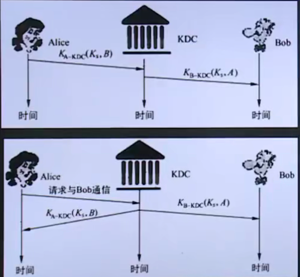

#### 2.证书认证机构

认证中心CA：将公钥和特定的实体绑定。

证实一个实体的真实身份，为实体颁发数字证书（实体身份和公钥绑定）。

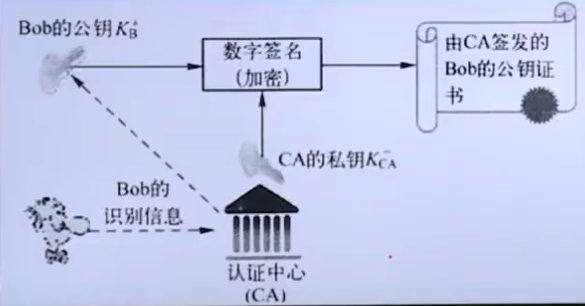

### 六、防火墙与入侵检测系统

#### 1.防火墙基本概念

防火墙：能够隔离组织内部网络与公共互联网，允许某些分组通过，而阻止其他分组进入或者离开内部网络的软件、硬件或软件硬件结合的一种设施。

前提：从外部到内部和从内部到外部的所有流量都经过防火墙。

#### 2.防火墙分类

1. 无状态分组过滤器：基于特定的规则对分组是通过还是丢弃进行决策。使用访问控制列表（ACL）实现防火墙规则。

2. 有状态分组过滤器：跟踪每个TCP连接建立、拆除，根据状态确定是否允许分组通过。

3. 应用网关：鉴别用户身份或针对授权用户开放特定服务。

#### 3.入侵检测系统IDS

入侵检测系统IDS是当观察到潜在的恶意流量时能够产生警告的设备或系统。

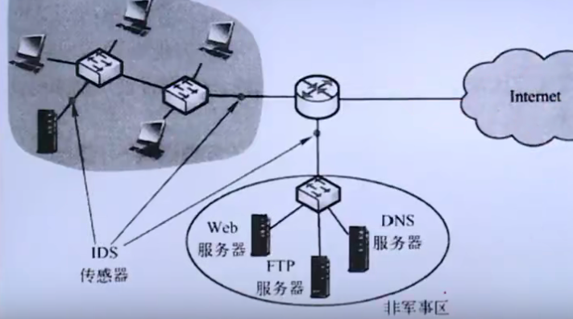

### 七、网络安全协议

#### 1.安全电子邮件

电子邮件安全需求：机密性、完整性、身份认证性、抗抵赖性

安全电子邮件标准：PGP

#### 2.安全套接字层SSL

SSL是介于应用层和传输层之间的安全协议。

SSL协议栈：

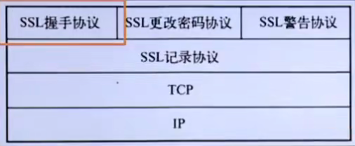

SSL握手过程：协商密码组，生成密钥，服务器/客户认证与鉴别。

#### 3.虚拟专用网VPN和IP安全协议IPSec

VPN：建立在公共网络上的安全通道，实现远程用户、分支机构、业务伙伴等与机构总部网络的安全连接，从而构建针对特定组织机构的专用网络。
关键技术：隧道技术，如IPSec。

典型网络层安全协议IPSec：提供机密性、身份鉴别、数据完整性验证和防重放攻击服务。
体系结构：**认证头AH协议、封装安全载荷ESP协议**。
运行模式：**传输模式**（AH传输模式、ESP传输模式）、**隧道模式**（AH隧道模式、ESP隧道模式）。

